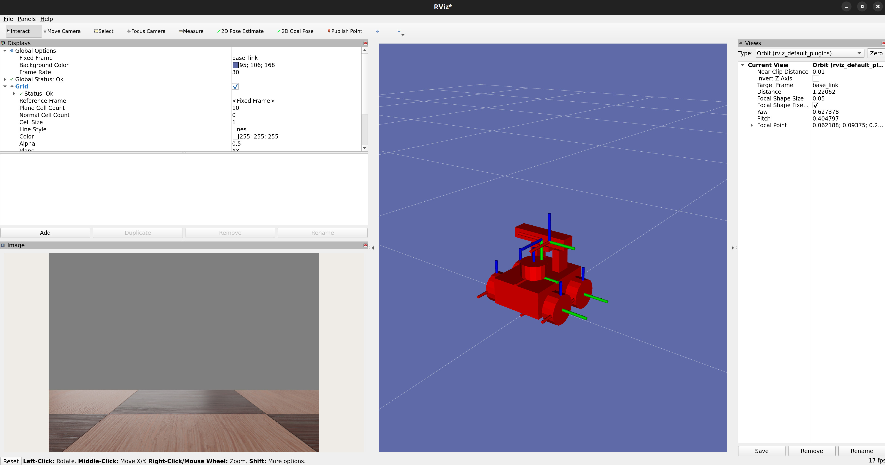

# mcs-ros2

Edge software for integrating ROS 2 / Webots simulation with MCS.

## Prerequisites
- NVIDIA GPU
- Ubuntu (22.04 / 24.04) on the AMD64 platform
- Installed ROS2 locally (Humble / Jazzy). For installation instructions, refer to: [ROS2 Installation Guide](https://docs.ros.org/en/jazzy/Installation/Ubuntu-Install-Debs.html)
- Docker & Docker compose
- Git

## Simulation headless (NVIDIA)
1. Clone this repository:
    ```sh
    git@github.com:CleverHiveSpace/mcs-ros2.git
    ```
2. Initialize the submodules:
    ```sh
    git submodule update --init --recursive
    ```
3. Start the simulation:
    ```sh
    docker compose -f webots-headless.compose.yaml up
    ```


## Simulation locally (GUI & Docker)
1. Clone this repository:
    ```sh
    git@github.com:CleverHiveSpace/mcs-ros2.git
    ```
2. Initialize the submodules:
    ```sh
    git submodule update --init --recursive
    ```
3. Add non-network local connections to access control list:
    ```sh
    xhost local:docker
    ```
4. Start the simulation:
    ```sh
    docker compose -f webots-local.compose.yaml up
    ```
    
> [!NOTE]  
> The initial setup may take some time as required assets are downloaded.

### RViz


To visualize the ROSbot's sensor data, you can run RViz2 within Docker:

```sh
docker compose -f rviz.compose.yaml up
```



### Teleop

Next, you can use the teleop_twist tool to control the ROSbot via your keyboard. To do this, enter the Rviz container in a new terminal:

```sh
docker exec -it rviz bash
```

If you have ROS2 installed locally, you can operate the ROSbot either from your local setup or within the Rviz container by running:
```sh
ros2 run teleop_twist_keyboard teleop_twist_keyboard
```

### Access the workspace
> [!TIP]  
> The workspace is mounted as a volume from the host machine, so any changes made to the files within the container will be reflected on the host machine.

Just go and modify `src/mcs_ros2`. 

OR
1. Enter the webots container:
    ```sh
    docker exec -it webots bash
    ```
2. Navigate to the workspace:
    ```sh
    cd /ros2_ws
    ```

> [!TIP]  
> Don't forget to `colcon build` and `source install/setup.bash` after any changes to the files within the container.

### Customize simulation files
The original simulation can be modified by editing the `src/mcs_webots_ros2` files, probably you want to modify `webots_ros2_cleverhive` package which is based on `webots_ros2_husarion`. This is a submodule forked from Husarion Webots / ROS 2 driver (which is a fork of the original Webots / ROS 2 driver). 

### Customize Docker image
The original Docker image used in the simulation is `husarion/webots-docker`. A partially fixed fork of the original repository is [CleverHiveSpace/mcs_webots_ros2_docker](https://github.com/CleverHiveSpace/mcs_webots_ros2_docker).

## Husarion Docker image

> [!NOTE]  
> The Husarion's image cannot be built as of Jan 2025 due to Webots version incompatibility and who the fuck knows what else. This project uses legacy image from 2023 which works stable with Webots nightly version `webots-R2024a-x86-64` which is currently NOT available in the official repositories.

> [!NOTE]  
> Husarion image can be build with webots version R2023 but there are some tf issues with the robot. Have a look at the [mcs_webots_ros2_docker](https://github.com/CleverHiveSpace/mcs_webots_ros2_docker) for more details.

> [!NOTE]  
> In case Husarion removed the image from the repositories, here is the backup image with webots nightly R2024: TBD

> [!NOTE]
> In case you want to install webots nightly version manually, here are the installers: 
> [R2024a Nightly Build 8/8/2023 d9de48d3bb9d9a31b101e1f198912df810a65a46](https://github.com/CleverHiveSpace/webots-R2024a-x86-64)

## MCS Edge Node (local)

If you don't have colcon installed, run:
```sh
sudo apt install python3-colcon-common-extensions
```
If you don't have rosdep installed, run:
```sh
sudo apt install python3-rosdep
```

All following commands must be used from the root of workspace (mcs-ros2)

Before building the project, resolve dependencies:
```sh
rosdep install -i --from-path src --rosdistro jazzy -y # specify ros distro you have installed
```
To build the project use command:
```sh
colcon build --symlink-install
```
Before you can use any of the installed executables or libraries, you will need to add them to your path and library paths. Use the command:
```sh
source install/setup.bash
```
or if you're using zsh:
```sh
source install/setup.zsh
```

To run the ros2 node which listens to the telemetry run:
```sh
ros2 run mcs_ros2 telemetry_listener
```

To run the ros2 node which listens to the camera run:
```sh
ros2 run mcs_ros2 camera_listener
```
